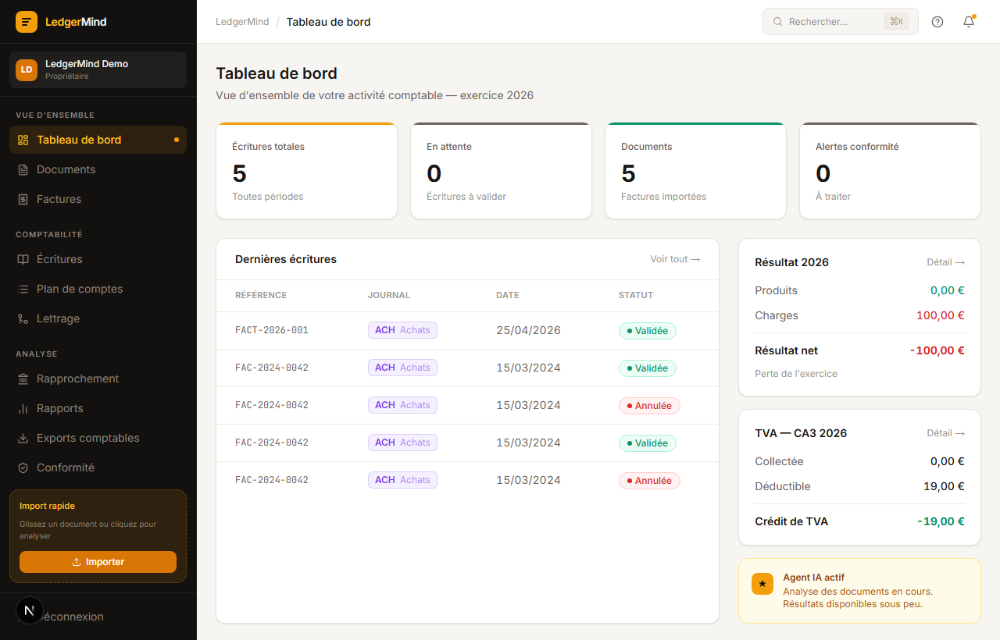
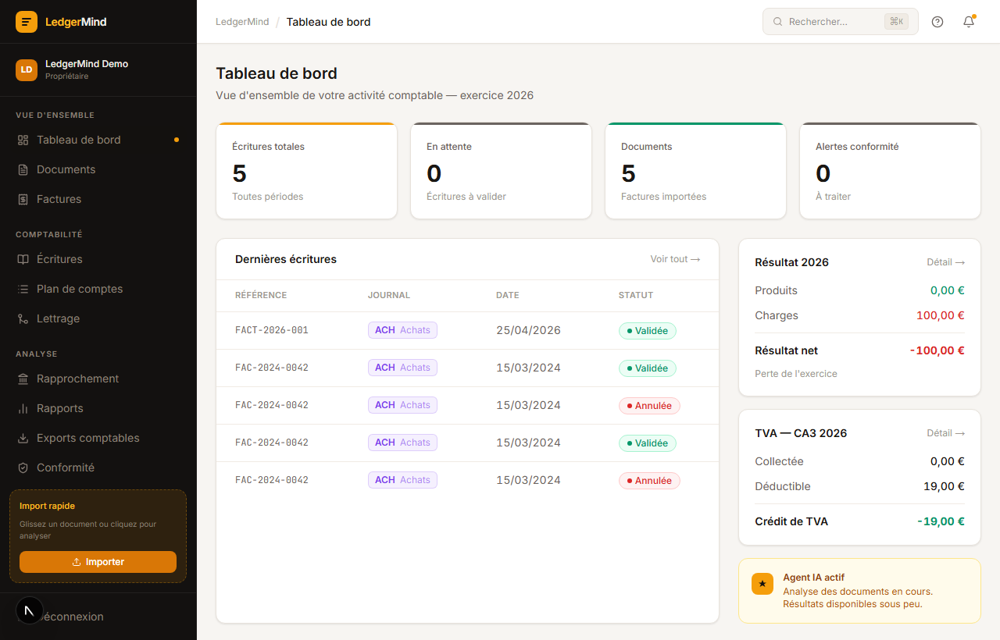
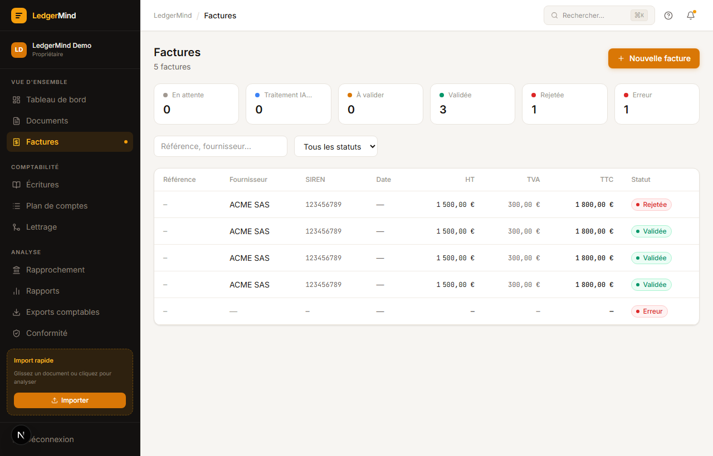
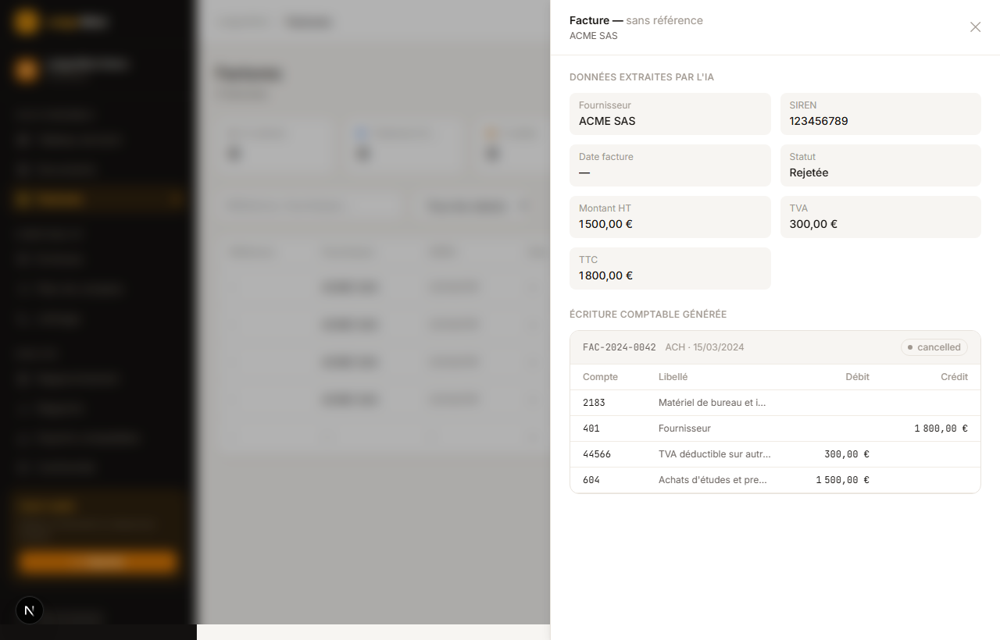
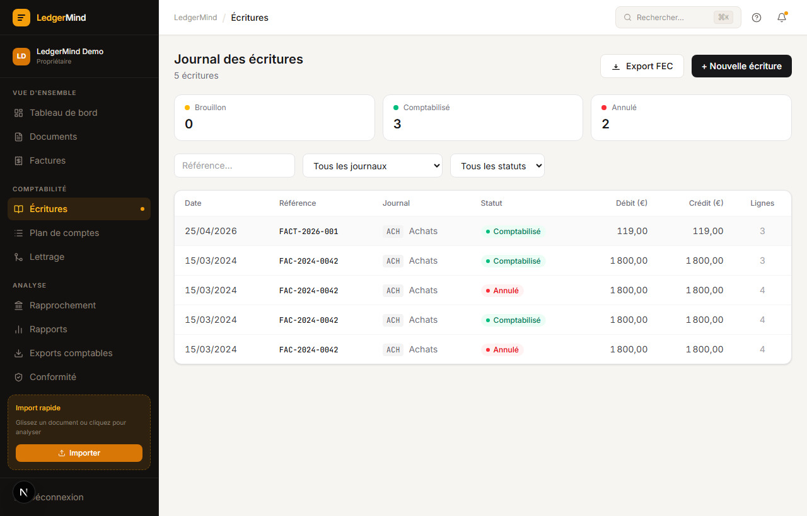
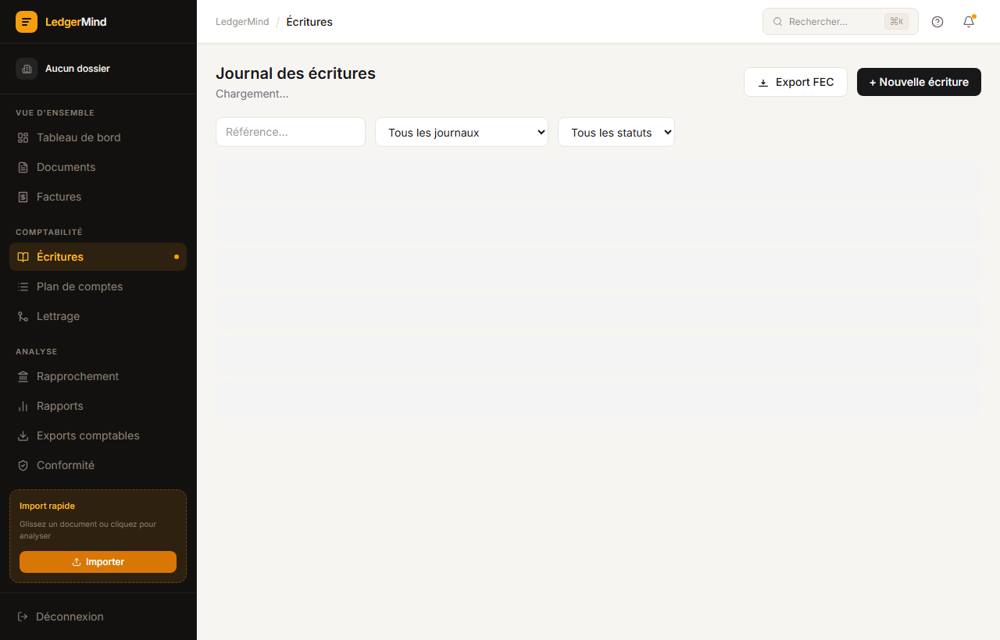

<div align="center">


# LedgerMind

**Comptabilité automatisée par IA pour TPE & PME françaises**

Déposez une facture. LedgerMind l'analyse, l'impute, et génère votre FEC — en quelques secondes.

[](https://python.org)
[](https://nextjs.org)
[](https://djangoproject.com)
[](https://langchain.ai)
[](LICENSE)

[Démo live](#) · [Documentation](#) · [Roadmap](#)

</div>

---

## Le problème

La saisie comptable manuelle représente **3 à 8 heures par mois** pour une TPE — du temps perdu sur des tâches sans valeur ajoutée : ressaisir les montants d'une facture, chercher le bon compte PCG, mettre en forme le fichier FEC.

LedgerMind automatise l'intégralité de ce flux, de la facture PDF au journal comptable validé.

---

## Comment ça marche

```
📄 Facture PDF  →  🤖 OCR + IA  →  📊 Écriture PCG  →  ✅ Validation  →  📁 Export FEC
    (upload)       (Qwen2.5 7B)     (Plan Comptable)    (human review)    (norme DGFiP)
```

1. **Déposez** votre facture (PDF, scan, email)
2. **L'IA extrait** vendeur, SIREN, montants HT/TVA/TTC
3. **L'agent comptable** impute automatiquement sur le bon compte PCG 2025
4. **Vous validez** (ou corrigez) en un clic
5. **Exportez** le FEC au format attendu par votre expert-comptable

---

## Captures d'écran

### Sélection d'organisation

> Accès multi-entité : chaque organisation est isolée (RLS PostgreSQL), avec affichage du rôle et du statut.



> _Capture : sélection d'organisation / panel latéral_

---

### Tableau de bord

> Vue en temps réel : factures en cours de traitement, écritures du mois, montant TVA collectée, alertes compliance.



> _Capture : tableau de bord avec KPIs et dernières écritures_

---

### Upload et traitement de factures

> Glisser-déposer ou sélection fichier. Le statut passe de `pending` → `processing` → `reviewed` en temps réel (polling SSE).



> _Capture : liste des factures avec filtres statut et recherche_

---

### Résultat d'analyse IA

> Extraction complète : vendeur, SIREN, montants HT/TVA/TTC, TVA applicable, compte PCG suggéré avec niveau de confiance.



> _Capture : drawer de détail avec extraction IA et écriture comptable générée_

---

### Grand livre comptable

> Journal des écritures avec filtres par période, compte, statut. Actions : valider un draft, annuler, pointer une écriture.



> _Capture : journal des écritures avec statuts Brouillon / Comptabilisé / Annulé_

---

### Export FEC

> Génération instantanée du Fichier des Écritures Comptables au format DGFiP. Téléchargement en un clic.



> _Capture : export FEC — bouton de génération du Fichier des Écritures Comptables_

---

## Fonctionnalités clés

| Fonctionnalité | Description |
|---|---|
| **OCR intelligent** | Extraction par LLM local (Qwen2.5 7B) — aucune donnée ne quitte votre infrastructure |
| **Plan Comptable Général** | Imputation automatique sur PCG 2025, avec validation métier |
| **Multi-entité** | Isolement strict par organisation via Row-Level Security PostgreSQL |
| **Workflow de validation** | Parcours draft → reviewed → posted, avec rôles OWNER / ACCOUNTANT / VIEWER |
| **Export FEC** | Format DGFiP conforme, compatible tous logiciels comptables |
| **Chiffrement des données** | Montants, SIREN, noms de fournisseurs chiffrés au repos (Fernet AES-128) |
| **RGPD natif** | Export de données, droit à l'oubli, anonymisation intégrés |
| **100 % local** | Ollama, PostgreSQL, MinIO, Redis — souveraineté totale des données |

---

## Stack technique

<table>
<tr>
<td><strong>Frontend</strong></td>
<td>Next.js 15, React 19, TypeScript 5, Tailwind CSS v4</td>
</tr>
<tr>
<td><strong>Backend</strong></td>
<td>Django 5, Django REST Framework, Celery, LangGraph</td>
</tr>
<tr>
<td><strong>IA</strong></td>
<td>Ollama — Qwen2.5 7B (OCR) · Mistral 7B (comptabilité)</td>
</tr>
<tr>
<td><strong>Base de données</strong></td>
<td>PostgreSQL 16 (RLS multi-tenant), Redis 7</td>
</tr>
<tr>
<td><strong>Stockage</strong></td>
<td>MinIO (S3-compatible, on-premise)</td>
</tr>
<tr>
<td><strong>Infrastructure</strong></td>
<td>Docker Compose, Traefik v3, MCP Servers (Rust)</td>
</tr>
</table>

---

## Démarrage rapide

### Prérequis

- Docker 24+ et Docker Compose v2
- [Ollama](https://ollama.ai) installé localement
- 8 Go RAM minimum (16 Go recommandés pour les modèles 7B)

### Installation en 3 étapes

```bash
# 1. Cloner et configurer
git clone https://github.com/FCHEHIDI/LedgerMind.git
cd LedgerMind
cp backend/config/settings/.env.example .env

# 2. Télécharger les modèles IA
ollama pull qwen2.5:7b
ollama pull mistral:7b

# 3. Lancer la stack complète
docker compose -f docker/docker-compose.dev.yml up -d
```

L'application est accessible sur **http://localhost:3000**  
L'API backend sur **http://api.localhost:8888**

### Créer le premier compte

```bash
docker compose -f docker/docker-compose.dev.yml exec api \
  python manage.py createsuperuser
```

---

## Sécurité & conformité

- **Données 100 % locales** — aucun envoi vers des API tierces (OpenAI, etc.)
- **Chiffrement au repos** — Fernet (AES-128-CBC + HMAC-SHA256) sur tous les champs sensibles
- **Isolation multi-tenant** — Row-Level Security au niveau base de données
- **Authentification** — JWT (access 15 min / refresh 7 jours) + blacklist
- **Accès admin** — restreint par IP via Traefik middleware
- **Audit OWASP Top 10** — effectué, voir `REVUE_TECHNIQUE.md`

---

## Roadmap

- [ ] **Connexion bancaire** — import automatique des relevés (DSP2)
- [ ] **Rapports TVA** — CA3 pré-rempli
- [ ] **Intégration expert-comptable** — accès en lecture seule sécurisé
- [ ] **Application mobile** — capture facture par photo
- [ ] **Mode SaaS** — option hébergement managé

---

## Licence

AGPL-3.0 — voir [LICENSE](LICENSE)

---

<div align="center">

Fait avec ☕ et beaucoup de rigueur comptable.

</div>
